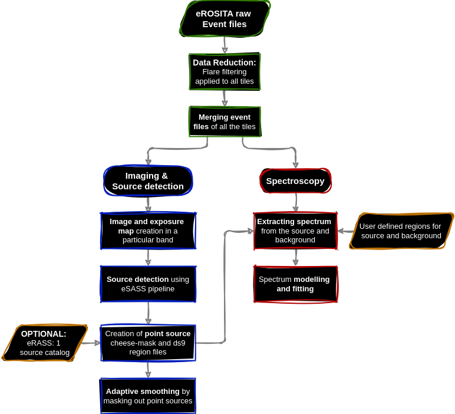

# Tutorials for eROSITA data reduction using the eSASS software.

Here is a brief overview of the eROSITA data reduction steps using the eSASS software. 


The tutorials are structured as follows:

## 1. [Introduction and Setup](01_Introduction_and_Setup.ipynb)
This contains the introduction to the eROSITA data reduction and common steps required for Image creation and spectral analysis.

The notebook covers the following steps:

- **Make Clean Event List**:
    - Define functions to run `evtool` and `radec2xy` commands.
    - Process event files to create cleaned event lists.

- **Extract the Lightcurve**:
    - Define a function to run `flaregti` for lightcurve extraction.
    - Process cleaned event lists to extract initial lightcurves.

- **Flare Filtering**:
    - Define functions for Gaussian fitting and sigma clipping.
    - Apply thresholds to lightcurves to identify and filter out flares.

- **Re-run `flaregti` with Calculated Thresholds**:
    - Re-extract lightcurves using the calculated thresholds to ensure flares are filtered out.

- **Re-run `evtool` using the New GTIs**:
    - Re-process event files using the new Good Time Intervals (GTIs) obtained from flare filtering.

- **Combine the Tiles**:
    - Merge the filtered event lists from different tiles into a single event list.
    - Separate the merged event list into individual Telescope Modules (TMs) for further analysis.

These steps provide a comprehensive guide to preparing eROSITA data for image creation and spectral analysis.

### Using the [Setup Script](Setup.py)

This script processes eROSITA data by performing several steps mentioned above. It uses parallel processing to speed up the data reduction process. Each file is processed in parallel to filter out flares and then merged into a single event list. 

#### Usage

To run the script, use the following command:
```bash
python Setup.py <input_dir> <output_dir> <timebin> <center_ra> <center_dec> [--ff_plots] [--ff_proof] [--separate_tm]
```

- `<input_dir>`: Input directory containing raw data.
- `<output_dir>`: Output directory for filtered data.
- `<timebin>`: Time bin size for lightcurve extraction.
- `<center_ra>`: Center RA in deg.
- `<center_dec>`: Center Dec in deg.

##### Optional Flags
- `--ff_plots`: Create flare filtering plots. Default is `True`.
- `--ff_proof`: Proof check flare filtering by creating lightcurves of the filtered event lists. Default is `False`.
- `--separate_tm`: Separate merged event list by Telescope Modules (TMs) 1 2 3 4 5 6 7 8 9. Default is `False`.

#### Example Usage

```bash
python Setup.py Data/Raw_data Data/Filtered_data 20 83.63 22.39 --ff_plots --separate_tm
```

This command will process the data in the specified input directory, save the results in the output directory, use a time bin size of 20, and set the center coordinates to RA 83.63 and DEC -5.39. It will also create log files and flare filtering plots.


## 2. [Image Creation](Imaging)

The folder contains scripts and notebooks for creating and processing images. For detailed descriptions of the scripts and notebooks, refer to the [Imaging README](Imaging/README.md).

### 2.1. Creating the Images
The [Imaging.py](Imaging/Imaging.py) script and the [02_Imaging_tutorial.ipynb](Imaging/021_Imaging_tutorial.ipynb) notebook process eROSITA data to generate images, exposure maps, and exposure-corrected images. 


### 2.2. Detecting and masking Sources
The [source_detection.py](eROSITA_eSASS_Tutorials/Imaging/source_detection.py) script and the [03_Source_detection.ipynb](eROSITA_eSASS_Tutorials/Imaging/022_Source_detection.ipynb) notebook perform source detection on the generated images, create background maps, and mask out point sources for further analysis.

### 2.3. Smoothing the Images
The [masking_smooting.py](eROSITA_eSASS_Tutorials/Imaging/masking_smooting.py) script handles the smoothing of images. the [03_Source_detection.ipynb](eROSITA_eSASS_Tutorials/Imaging/022_Source_detection.ipynb) notebook contains the tutorial for the same. The script offers optional task of masking of point sources based on a ds9 region file.

## 3. [Spectral Analysis](Spectra)