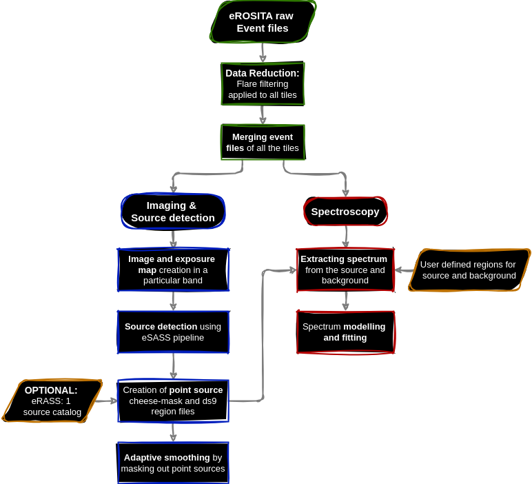

# Tutorials for eROSITA data reduction using the eSASS software.

Here is a brief overview of the eROSITA data reduction steps using the eSASS software.


The tutorials are structured as follows:

## 1. Data Preparation — [Setup.py](Setup.py)

This script is the main data reduction script. It takes raw eROSITA event files across multiple sky tiles and produces flare-filtered, merged event lists ready for imaging and spectral analysis. Tiles are processed in parallel using `multiprocess`.

#### Functions

1. **Clean Event Lists** — Runs `evtool` on every raw event file to apply standard flag and pattern filters.

2. **Lightcurve Extraction** — Runs `flaregti` on each cleaned event list to extract a hard-band (>5 keV) count-rate lightcurve.

3. **Flare Threshold Calculation** — Fits a Gaussian to the lightcurve rate distribution; iterative 3-sigma clipping is applied and the upper 3-sigma limit of the clipped fit is taken as the flare threshold.

4. **Re-run `flaregti`** — Re-runs `flaregti` with per-tile thresholds to produce final Good Time Intervals (GTIs).

5. **Flare-filtered Event Lists** — Runs `evtool` with the new GTIs to produce the final filtered event lists. Optionally re-extracts lightcurves for visual verification (`--ff_proof`).

6. **Merging Tiles** — Merges all filtered event lists into a single event list using `evtool`. Optionally splits by Telescope Module (`--separate_tm`).

All output is logged to `filtering.log` and per-step log files.

#### Usage

```bash
python Setup.py <input_dir> <output_dir> <timebin> <center_ra> <center_dec> [--ff_plots] [--ff_proof] [--separate_tm]
```

| Argument | Description |
|---|---|
| `input_dir` | Directory containing raw data tiles |
| `output_dir` | Directory where filtered files and logs are saved |
| `timebin` | Time bin size (seconds) for lightcurve extraction |
| `center_ra` | Field centre RA in degrees |
| `center_dec` | Field centre Dec in degrees |
| `--ff_plots` | Save flare filtering diagnostic plots (default: on) |
| `--ff_proof` | Re-extract lightcurves after filtering for visual verification |
| `--separate_tm` | Also split the merged event list by TM |

#### Example

```bash
python Setup.py Data/Raw_data Data/Filtered_Data/ 20 258.11 -39.68 --ff_plot --ff_proof --separate_tm
```

> An interactive walkthrough of the same steps is available in [01_Introduction_and_Setup.ipynb](01_Introduction_and_Setup.ipynb).

#### 1.1. Plotting the input tiles - [plot_tiles.py](plot_tiles.py)
This script produces a sky map of the input tiles to visualise the coverage of the observation. 

## 2. Image Creation — [Imaging/Imaging.py](Imaging/Imaging.py)

This script takes a merged event file and produces count images, exposure maps, and exposure-corrected images for a given energy band or in RGB.

#### Functions

1. **Image creation** — Bins the event file into a sky image using `evtool`. In RGB mode all three bands are processed concurrently.
2. **Exposure map** — Runs `expmap` on the image to produce a vignetting-corrected exposure map.
3. **Exposure correction** — Divides the counts image by the exposure map to produce a exposure corrected image.

#### Usage

```bash
python Imaging.py <event_file> <output_dir> <band_min> <band_max>
python Imaging.py <event_file> <output_dir> --rgb [--rgb_bands R_MIN R_MAX G_MIN G_MAX B_MIN B_MAX]
```

| Argument | Description |
|---|---|
| `event_file` | Input (merged) event file |
| `output_dir` | Directory for output images and log |
| `band_min / band_max` | Energy band in eV (required unless `--rgb`) |
| `--rgb` | Create a three-band RGB image |
| `--rgb_bands` | Custom RGB band edges in eV (default: 200–700, 700–1100, 1100–2300) |
| `--ds9` | Open the result in DS9 after completion |

#### Example

```bash
python Imaging.py merged_events.fits Images/ 200 2300
python Imaging.py merged_events.fits Images/ --rgb --rgb_bands 200 700 700 1100 1100 2300
```

> See [Imaging/021_Imaging_tutorial.ipynb](Imaging/021_Imaging_tutorial.ipynb) for an interactive tutorial.


## 3. Source Detection & Point-Source Masking — [Imaging/source_detection.py](Imaging/source_detection.py)

This script runs the full eSASS source detection chain on a count image and produces a point-source catalogue and a cheese mask.

#### Functions

1. **Detection mask** — Runs `ermask` on the exposure map to create a binary detection mask.
2. **Local source detection** — Runs `erbox` in sliding-box mode to produce an initial source list.
3. **Background map** — Runs `erbackmap` with the local source list to estimate the background.
4. **Map-mode source detection** — Re-runs `erbox` using the background map for a refined source list.
5. **Maximum-likelihood fitting** — Runs `ermldet` to derive source parameters and a model source image.
6. **Catalogue preparation** — Runs `catprep` to produce a standard source catalogue.
7. **Cheese mask** — Constructs a circular exclusion mask around each source at the requested angular radius.

A pre-existing catalogue can be supplied via `--pts_catalog` to skip detection and go directly to mask creation.

#### Usage

```bash
python source_detection.py <input_image> <input_expmap> <output_dir> <PS_size> [--pts_catalog <catalog>] [--ds9]
```

| Argument | Description |
|---|---|
| `input_image` | Input count image (FITS) |
| `input_expmap` | Corresponding exposure map (FITS) |
| `output_dir` | Directory for all outputs |
| `PS_size` | Exclusion radius around each point source in arcmin |
| `--pts_catalog` | Use an existing source catalogue instead of running detection |
| `--ds9` | Open the cheese mask and region file in DS9 |

> See [Imaging/022_PTS_removal.ipynb](Imaging/022_PTS_removal.ipynb) for an interactive tutorial.


#### 3.1. Cheese-Mask Editing — [Imaging/masking.py](Imaging/masking.py)

Allows manual refinement of a cheese mask by reading a DS9 region file and masking the specified circular regions.


## 4. Adaptive Smoothing — [Imaging/adaptive_smoothing.py](Imaging/adaptive_smoothing.py)

Smooths a count image to a target signal-to-noise ratio using either XMM-SAS `asmooth` or eSASS `erbackmap`.

#### Functions

1. **Mask application** — Applies the cheese mask to the image and exposure map to exclude point sources.
2. **Adaptive smoothing** — Runs the chosen tool (`xmm-sas` / `eSASS`) to smooth the masked image to the desired SNR.
3. **Output** — Saves the smoothed FITS image and a log file.

#### Usage

```bash
python adaptive_smoothing.py <input_image> <input_expmap> <desired_snr> <cheesemask_file> <asmooth_tool> \
    [--boxlist_file <file>] [--detmask_file <file>] [--emin <eV>] [--emax <eV>] [--ds9]
```

| Argument | Description |
|---|---|
| `input_image` | Path to the input image file |
| `input_expmap` | Path to the input exposure file. |
| `desired_snr` | Desired signal-to-noise ratio for asmooth |
| `cheesemask_file` | Path to the cheese-mask file. |
| `asmooth_tool` | `xmm-sas` or `eSASS` |
| `--boxlist_file` | Required for eSASS mode |
| `--detmask_file` | Required for eSASS mode |
| `--emin / --emax` | Energy range in eV, required for eSASS mode |

> The adaptive smoothing workflow is also demonstrated in [Imaging/022_PTS_removal.ipynb](Imaging/022_PTS_removal.ipynb).


## 5. Spectral Analysis — [Spectra/spectra_extraction.py](Spectra/spectra_extraction.py)

Extracts source and background spectra from a merged eROSITA event file using user-defined DS9 region files.

#### Functions

1. **Mask creation** — Converts DS9 region files into FITS masks combined with the cheese and detection masks.
2. **Source spectrum extraction** — Runs `srctool` on the source region to extract the spectrum, ARF, and RMF.
3. **Background spectrum extraction** — Runs `srctool` on the background region to extract the corresponding response files.
4. **Spectral corrections** — Applies effective area corrections to both spectra.
5. **Spectral grouping** — Groups the source spectrum to a minimum SNR using `grouppha`.

#### Usage

```bash
python spectra_extraction.py <input_events> <src_region> <bkg_region> <cheesemask_file> <detmask_file>
```

| Argument | Description |
|---|---|
| `input_events` | Input merged event file |
| `src_region` | DS9 region file for the source region (pixel coordinates) |
| `bkg_region` | DS9 region file for the background region (pixel coordinates) |
| `cheesemask_file` | Path to the cheese-mask FITS file |
| `detmask_file` | Path to the detection mask FITS file |

#### Example

```bash
python spectra_extraction.py Data/Filtered_Data/Merged/merged_events.fits \
    Spectra/src.reg Spectra/bkg.reg \
    Data/Source_Cat/cheesemask_PS_1.5arcmin.fits \
    Data/Source_Cat/detmask.fits
```

> An interactive walkthrough is available in [Spectra/03_Extract_Spectra.ipynb](Spectra/03_Extract_Spectra.ipynb).

#### 5.1. Spectral Fitting Notebooks

- **[bkg_spectra_analysis.ipynb](Spectra/bkg_spectra_analysis.ipynb)** — Demonstrates background spectral modelling and subtraction. This model can then be used in the source spectral fitting.

- **[source_spectra_analysis.ipynb](Spectra/source_spectra_analysis.ipynb)** — Demonstrates spectral fitting of the extracted source spectra using PyXSPEC.

